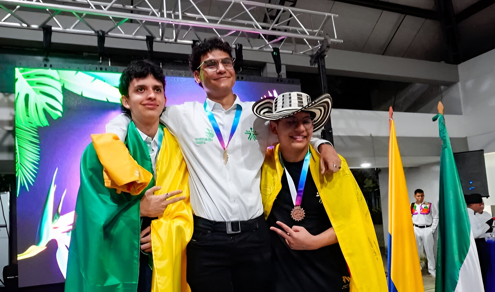

# Worldskills Colombia 2025 **– 🥇 Oro Nacional en Desarrollo de Software**

Este repositorio reúne el trabajo desarrollado durante mi **participación en la competencia nacional WorldSkills Colombia 2025**, en la **habilidad 09 – Desarrollo de Software**, donde obtuve **el primer lugar a nivel nacional**.

La competencia se llevó a cabo durante **tres jornadas intensivas**, en las que representé con orgullo a la **regional Guajira**, enfrentando retos de alto nivel técnico que pusieron a prueba mis conocimientos, mi capacidad de adaptación y mi manejo del tiempo.

El evento contó con la participación de **los cinco mejores competidores del país**. Durante las pruebas, me enfrenté directamente a cada uno de ellos, logrando un desempeño sólido y consistente a lo largo de toda la competencia.

