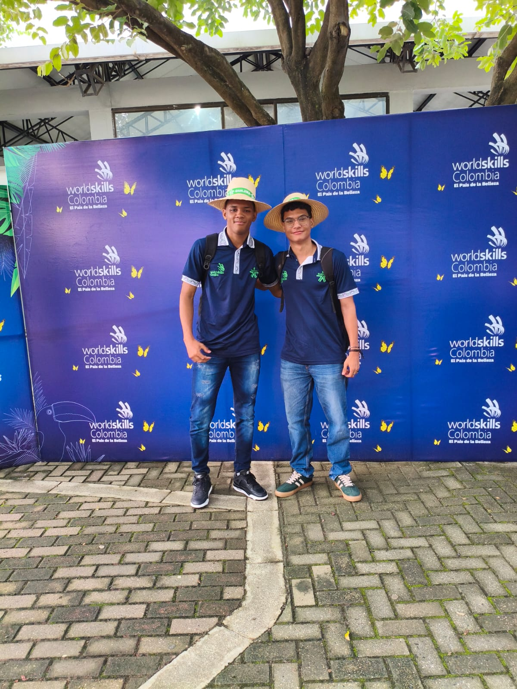
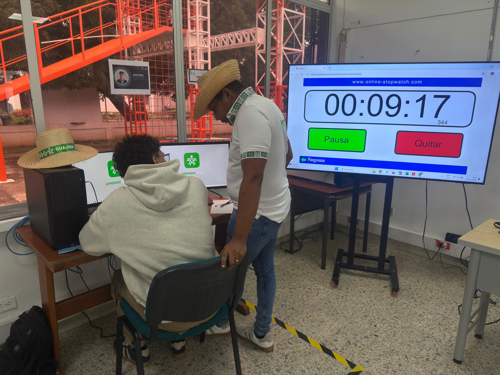
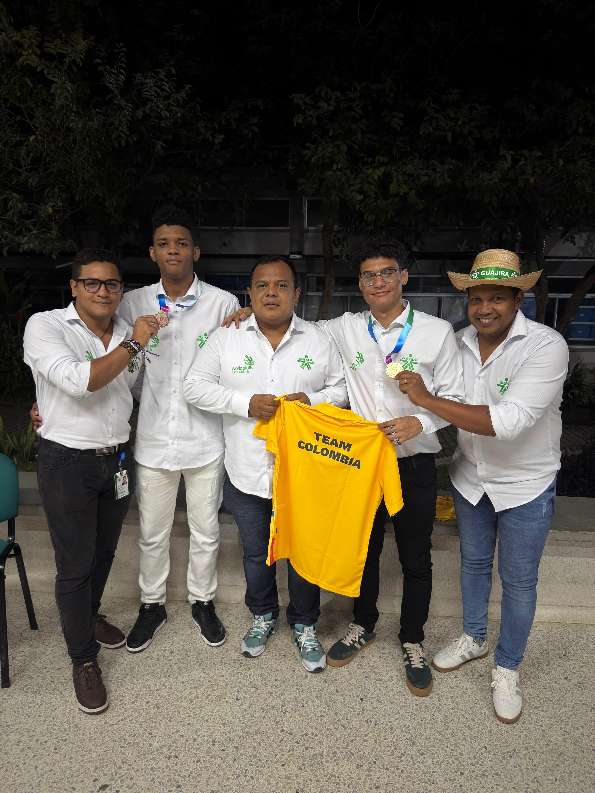

# Worldskills Colombia 2025 **– 🥇 Oro Nacional en Desarrollo de Software**

[🥇 Ver anterior competencia (Preselección)](https://github.com/JuanPabloMendozaLopez/worldskills-preseleccion-2025)

[🥇 Ver siguiente competencia (Américas)](https://github.com/JuanPabloMendozaLopez/worldskills-americas-2025)

[📰 Noticias](https://www.elheraldo.co/la-guajira/2025/10/09/aprendiz-del-sena-la-guajira-representara-a-colombia-en-worldskills-shanghai-2026/)

<br>


Este repositorio reúne el trabajo desarrollado durante mi **participación en la competencia nacional WorldSkills Colombia 2025**, en la **habilidad 09 – Desarrollo de Software**, donde obtuve **el primer lugar a nivel nacional**.

La competencia se llevó a cabo durante **tres jornadas intensivas**, en las que representé con orgullo a la **regional Guajira**, enfrentando retos de alto nivel técnico que pusieron a prueba mis conocimientos, mi capacidad de adaptación y mi manejo del tiempo.

El evento contó con la participación de **los cinco mejores competidores del país**. Durante las pruebas, me enfrenté directamente a cada uno de ellos, logrando un desempeño sólido y consistente a lo largo de toda la competencia.

<br>

<div align="center">


</div>

<br>

## 📚 Tabla de Contenidos

- [🏅 Highlights de la Competencia](#-highlights-de-la-competencia)
- [📁 Estructura del Repositorio](#-estructura-del-repositorio)
- [🎯 Descripcion de la Competencia](#-descripcion-de-la-competencia)
- [📬 Contacto](#-contacto)

<br>

## 🏅 Highlights de la Competencia

<div align="center">

  
  
  _Delegación del la Guajira 2025_
  
  
  
  _Durante la ejecución de las pruebas técnicas en la competencia nacional_
  
  
  
  _Logros obtenidos por la Guajira._

</div>

<br>

## 📁 Estructura del Repositorio

```bash
worldskills-colombia-2025/
├── docs/                       # Documentacion e información de la competencia
└── README.md                   # Documentación principal del repositorio
```

<br>

## 🎯 Descripcion de la Competencia  

<br>

## 📬 Contacto

Para preguntas, soporte o colaboración, por favor contacta:

-   Juan Pablo Mendoza Lopez
-   Correo: [mendozalopez.py@gmail.com](mailto:mendozalopez.py@gmail.com)
-   LinkedIn: [Juan Pablo Mendoza Lopez](https://www.linkedin.com/in/juan-pablo-mendoza-lopez/)
-   GitHub: [@JuanPabloMendozaLopez](https://github.com/JuanPabloMendozaLopez)


